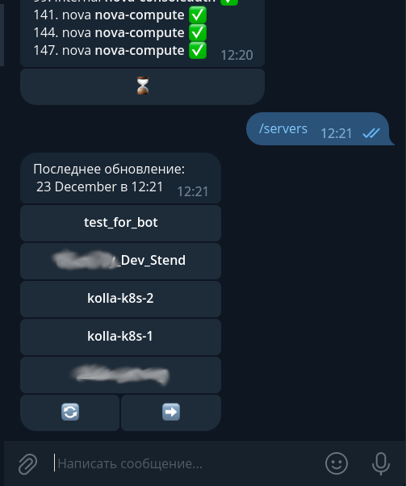

## OpenStackBot
### Установка Docker
```bash
docker build -t osapibot:latest . 
vim .env # **OS_CREDS and TOKEN
docker run -d --name osapibot --env-file=.env -v $PWD/store:/opt/store osapibot:latest
```

### Установка Linux
Python3 >= 3.8
```bash
python3 -m venv venv
source ./venv/bin/activate
pip install -r deps.txt
vim .env # **OS_CREDS and TOKEN
# PRERUN
python3 main.py

# TODO
sudo cp ./system/cloudatebot.service /etc/systemd/system/cloudatebot.service
sudo systemctl daemon-reload
sudo systemctl enable --now cloudatebot.service
```

### Примеры
    Команда /start 


    Команда /services - мониторинг всех сервисов 


    Команда /servers - выбор серверов, пролистывание\обновление через колбек 




    Колбек на определенный сервер 

